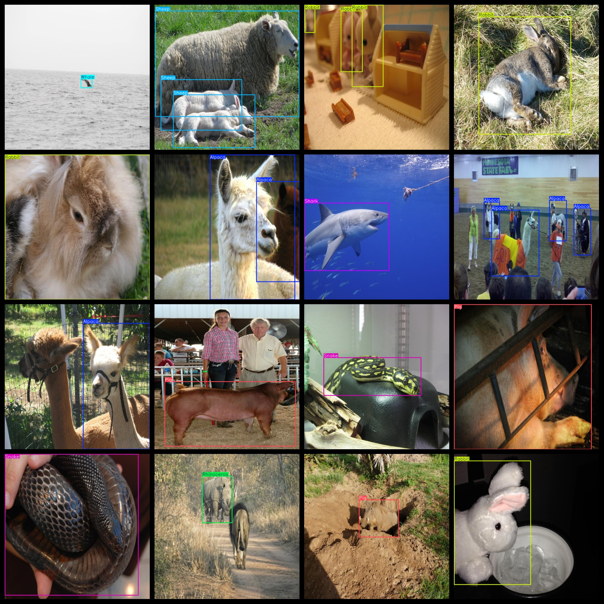
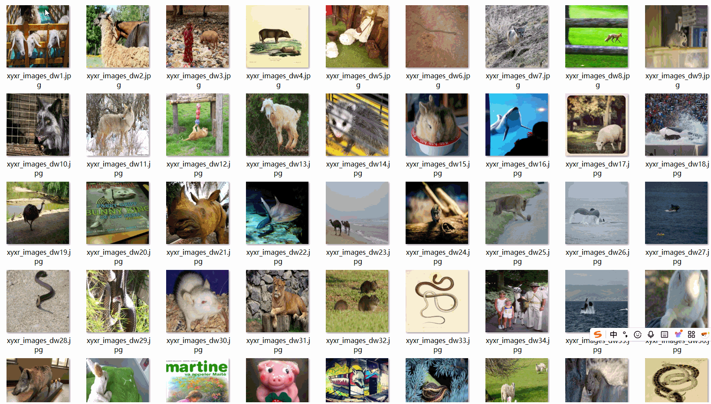

# 13 Types Animal Dataset 9800 Images VOC+YOLO Format

The dataset consists of 13 types of animals, with a total of 9800 images in the VOC+YOLO format. The dataset is divided into three folders: JPEGImages, Annotations, and labels.

In the JPEGImages folder, there are a total of 9800 jpg images. In the Annotations folder, there are 9800 xml files, and in the labels folder, there are 9800 txt files.

The number of labels varies from 1 to 13, with each label having its own set of frames (yolo format). For example, Alpaca has 829 frames, Camel has 1340 frames, Fox has 559 frames, Lion has 1653 frames, Mouse has 857 frames, Ostrich has 640 frames, Pig has 1613 frames, Rabbit has 1382 frames, Rhinoceros has 724 frames, Shark has 625 frames, Sheep has 3430 frames, Snake has 1377 frames, and Whale has 1014 frames.

The total number of frames across all labels is 16043. The resolution of the images is clear, and they have not been enhanced. The shape of the labels is rectangular boxes used for target detection recognition.

It is important to note that this dataset does not guarantee the accuracy or precision of any models trained on it or their weights. It only provides accurate and reasonable annotations.

The annotation and image details are as follows:

## Images

---

Here is a pay link on Stripe (https://buy.stripe.com/3cs8yP7sY87d0vu9AB). Please contact me lonlonago@foxmail.com after funding $89, and I will send you a complete data files, thank you!

